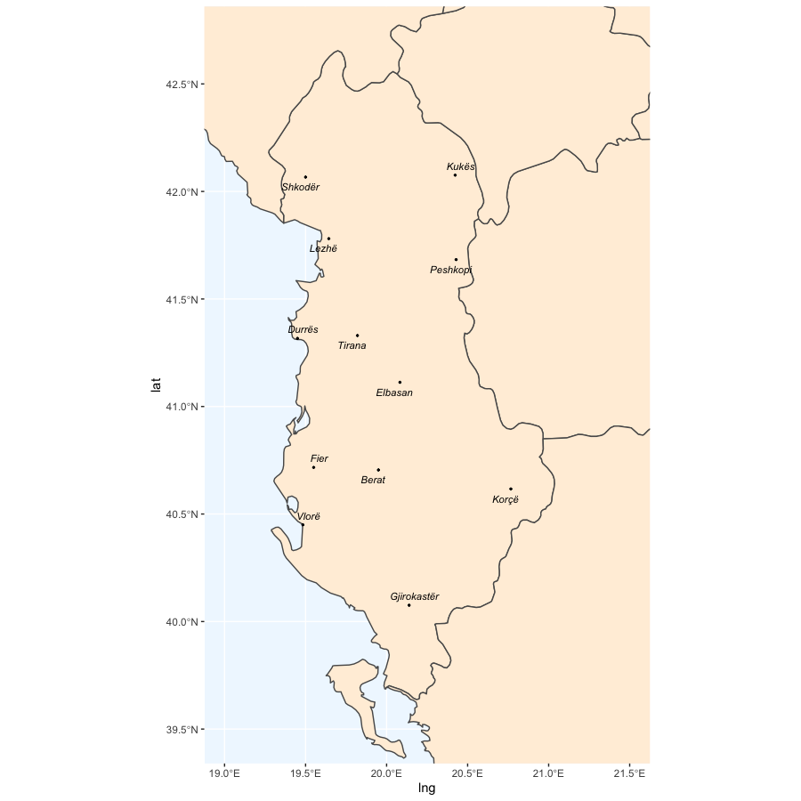

```{r setup, include=FALSE}
library(learnr)
library(tidyverse)
library(ggmosaic)
library(ggalluvial)
knitr::opts_chunk$set(echo = TRUE)
library(intRo)
data("endangered")
data("europe")
data("alb_capitals")
data("personality")
data("harry_potter")
```

## Maps, maps, maps!

It's very easy to plot maps in R.
If this is your cup of tea, the excellent book [Geocomputation with R](https://bookdown.org/robinlovelace/geocompr/), by Lovelace, Nowosad and Muenchow, will teach you all you need to know.
Check the it out!

Look at how simple it is to create maps.
<u>Note</u>: to avoid asking you to install external software required for the package sf, I will just show you code to plot a map and the image output. For info on how to use sf, see <https://r-spatial.github.io/sf/index.html>.

```{r alb, eval=FALSE}
library(ggrepel)
library(sf)

ggplot() +
  geom_sf(data = europe, fill = "antiquewhite1") +
  geom_point(data = alb_capitals, aes(lng, lat), size = 0.5) +
  geom_text_repel(data = alb_capitals, aes(lng, lat, label = city), size = 3, fontface = "italic") +
  coord_sf(c(19, 21.5), c(39.5, 42.7)) +
  theme(panel.background = element_rect(fill ="aliceblue"))
```

And this is the map.

```{r alb-map, echo=FALSE, out.height=500, fig.align='center'}

```


## Getting artsy with mosaic plots

Mosaic plots are a good way to visualise the number of occurrences in two intersecting categorical variables.

In the following code, we are plotting our `endangered` data frame, with `status` on the *x*-axis and `Macroarea` on the *y*-axis.

The main function here is `geom_mosaic()`.
`geom_mosaic()` is part of the ggmosaic package.

```{r mosaic, exercise=TRUE}
library(ggmosaic)

endangered %>%
  ggplot() +
  geom_mosaic(
    aes(x = product(Macroarea), fill = status), divider = mosaic("v")
  ) +
  scale_fill_brewer(palette = "Reds") +
  theme_mosaic() +
  # This rotates the tick labels of the x-axis
  theme(axis.text.x = element_text(angle = 90, hjust = 1, vjust = 0.5))
```

The coloured boxes in the plot are proportional to the number of languages in the data frame that belong to the intersecting cells of `status` and `Macroarea`.
Proportionality is represented both in the horizontal and vertical axes.

## Visualise questionnaire data

### Likert scales

If you have questionnaire data that uses Likert scales, diverging stacked bar charts are for you.

You have two options:

- Use ggplot2.
- Use the likert package and `likert()` from the HH package.

In either case, you will very likely have to wrangle the data so that it can be plotted.

You can see worked out examples at these websites:

- <http://rnotr.com/likert/ggplot/barometer/likert-plots/> for ggplot2.
- <https://rpubs.com/tskam/likert> for `likert()`

Due to time constraints we won't be able to go through them, but everything you learnt during the workshop will have gotten you up to speed to be able to follow the instructions in the links above.

### Alluvial plots

You can create alluvial plots to show the distribution of occurrences across several categorical variables.
This type of plots comes handy with questionnaire data which is stratified by, for example, age, gender

In the following example, we are visualising the distribution of survival of the passengers of the Titanic (data from <https://www.encyclopedia-titanica.org/explorer/>).

```{r titanic, exercise=TRUE}
titanic_wide <- data.frame(Titanic)

titanic_wide %>%
  ggplot(
    aes(axis1 = Class, axis2 = Sex, axis3 = Age, y = Freq)
  ) +
  geom_alluvium(aes(fill = Survived)) +
  geom_stratum() +
  geom_text(stat = "stratum", aes(label = after_stat(stratum))) +
  scale_x_discrete(limits = c("Class", "Gender", "Age"), expand = c(.2, .05)) +
  labs(
    x = "Demographic",
    title = "Passengers on the maiden voyage of the Titanic",
    subtitle = "Stratified by demographics and survival"
  )
  theme_minimal()
```

The geometries `geom_alluvium()` and `geom_stratum()` are the core functions of alluvial plots.
They are provided by the ggalluvial package.
You can read more about alluvial plots with ggalluvial here: <https://corybrunson.github.io/ggalluvial/>.

## Grouping and summarising

Part of data transformation requires you to group and summarise data.

The `group_by()` and `summarise()` functions can help you do exactly that.

Here's an example of how they work.

```{r group, exercise=TRUE}
harry_potter %>%
  group_by(house, element) %>%
  summarise(
    number = n()
  )
```

Read more about them here: <https://r4ds.had.co.nz/transform.html#grouped-summaries-with-summarise>
